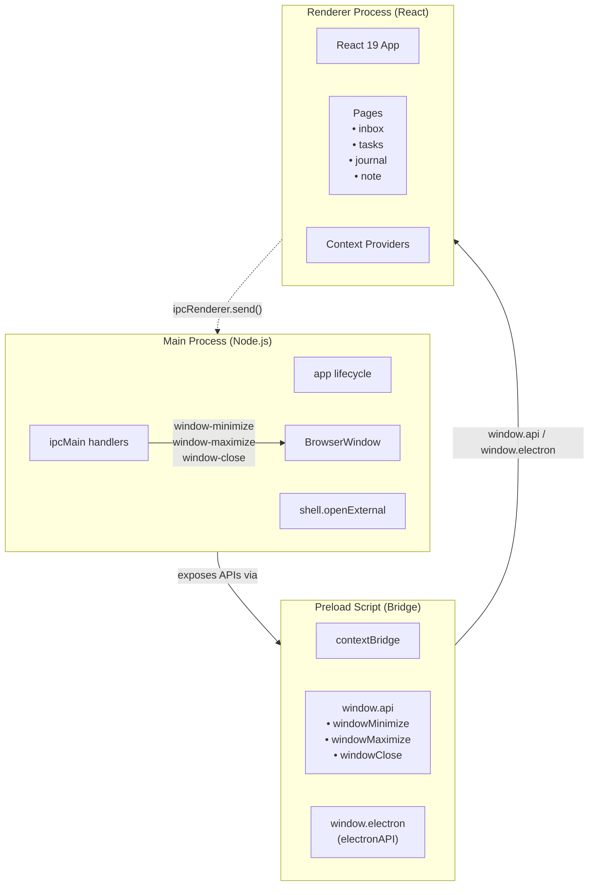
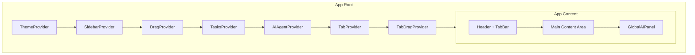
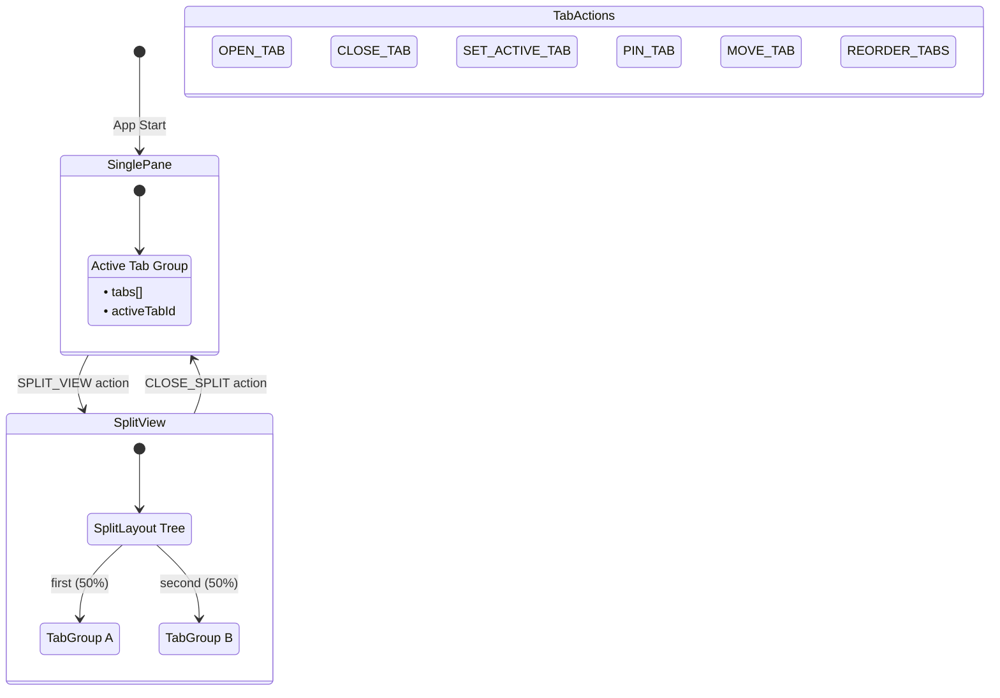
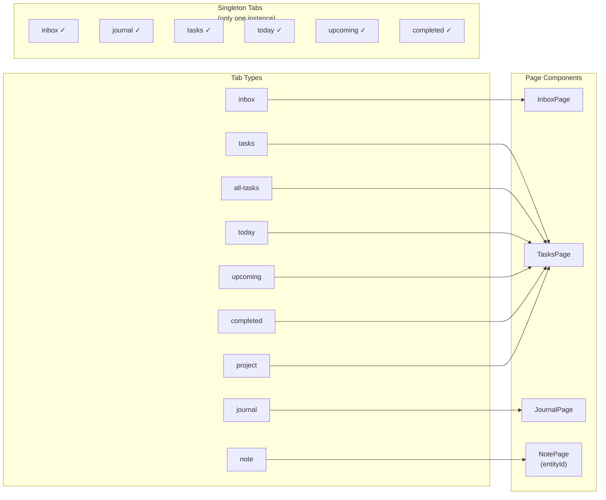
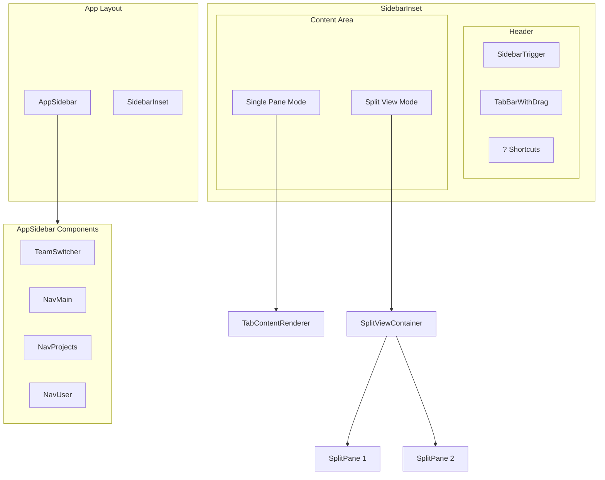
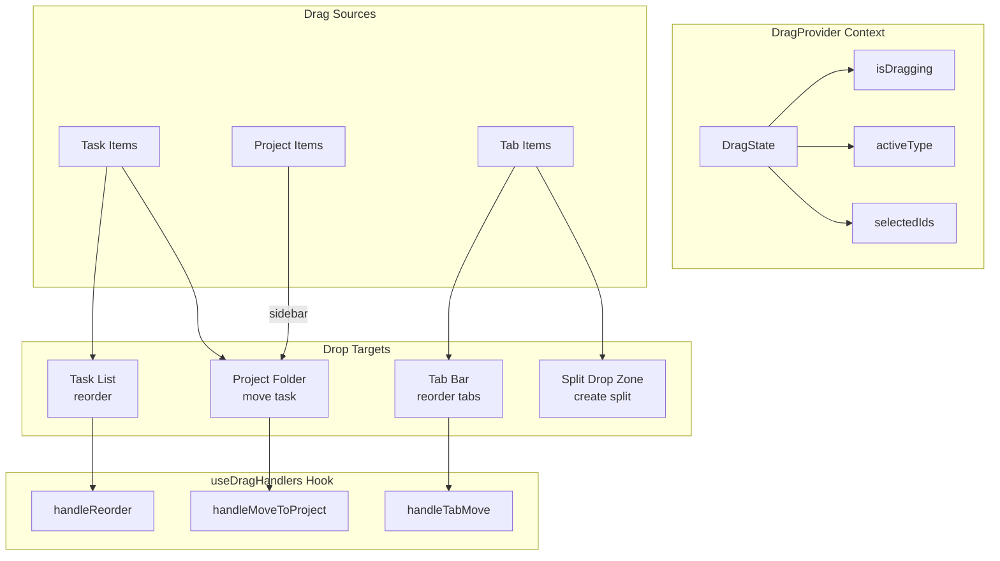
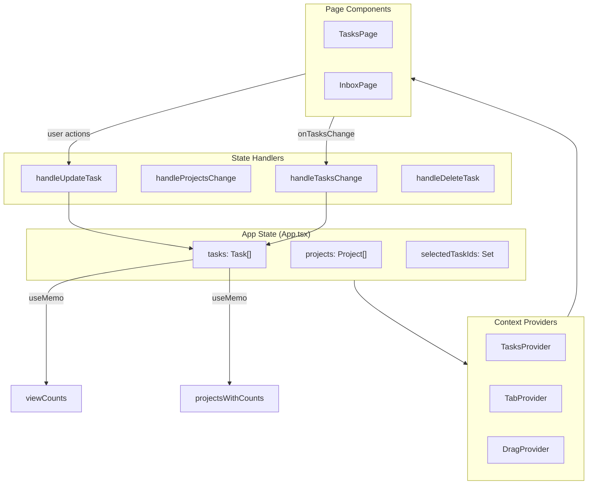

# Memry Architecture Diagrams

This document provides visual diagrams of the Memry application architecture using Mermaid.

---

## 1. Electron Process Architecture

This shows the three-layer Electron architecture with IPC communication:

---

## 2. React Provider Hierarchy

This shows how Context providers wrap the application:

---

## 3. Tab System State Architecture

Shows the VS Code-style tab system with split view support:

---

## 4. Tab Types & Content Routing

Shows how different tab types route to pages:

---

## 5. Component Architecture

High-level view of the component structure:

---

## 6. Drag & Drop System

Shows the unified drag-drop architecture:

---

## 7. Data Flow Architecture

Shows how task data flows through the application:

---

## Summary

| Diagram | What it Shows |
|---------|---------------|
| **#1 Electron Architecture** | Three-process model with IPC communication |
| **#2 Provider Hierarchy** | React Context nesting order |
| **#3 Tab System State** | VS Code-style tab management with split views |
| **#4 Tab Routing** | How tab types map to page components |
| **#5 Component Architecture** | Layout structure and component relationships |
| **#6 Drag & Drop** | Unified drag-drop system with sources/targets |
| **#7 Data Flow** | Task state management and callbacks |
