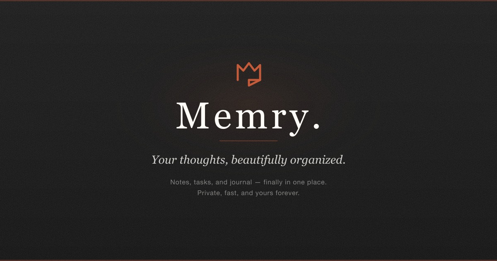

<div align="center">



# memry

**Your thoughts. Your devices. Your control.**

A private, offline-first workspace for notes, journals, and tasks — with real-time sync that never sees your data.


> **Not yet released.** memry is under active development and hasn't shipped a public version yet. Star the repo or watch for updates — downloads will be available once we reach a stable release.

</div>

---

Most note apps ask you to trust them with your thoughts. memry doesn't.

Everything you write is **encrypted on your device** before it ever leaves. Not even we can read it. Your notes sync across all your devices in real-time — but the servers only ever see encrypted noise.

No cloud lock-in. No subscription walls for basic features. No "oops, we got breached" emails. Just a fast, beautiful app that works whether you're online or off.

---

## What you get

<table>
<tr>
<td width="50%">

### Write freely

A distraction-free editor that stays out of your way. Rich text, markdown, wiki-style `[[links]]` between notes — connect ideas naturally.


</td>
<td width="50%">

### Think in connections

Every `[[link]]` creates a two-way connection. See what links back to any note. Watch your personal knowledge graph grow without effort.

</td>
</tr>
<tr>
<td width="50%">

### Journal daily

A dedicated space for daily reflection. Calendar view with activity streaks so you can see your consistency at a glance. Just open the app and start writing.

</td>
<td width="50%">

### Track what matters

Tasks and projects live alongside your notes — not in a separate app. Priorities, due dates, drag-and-drop. Simple enough for groceries, structured enough for goals.

</td>
</tr>
</table>

---

## Sync without compromise

<div align="center">

</div>

Most apps make you choose: **privacy** or **sync**. memry gives you both.

|                    | memry                                                           | Typical note apps                           |
| ------------------ | --------------------------------------------------------------- | ------------------------------------------- |
| **Encryption**     | End-to-end. We literally can't read your notes.                 | "Encrypted at rest" (they hold the keys)    |
| **Offline**        | Full functionality. No internet needed.                         | Degraded or broken without connection       |
| **Conflicts**      | Smart merge — edits from multiple devices combine automatically | Last save wins (your edits disappear)       |
| **Data ownership** | SQLite on your machine. Export anytime.                         | Proprietary format on someone else's server |

<details>
<summary><strong>How does the sync actually work?</strong></summary>

<br>

When you edit a note on one device, memry:

1. **Encrypts** the change locally using military-grade cryptography (XChaCha20-Poly1305 + Ed25519 signatures)
2. **Sends** the encrypted blob to the sync server — which stores it without being able to decrypt it
3. **Delivers** it to your other devices, where it's decrypted locally
4. **Merges** intelligently using CRDTs (Conflict-free Replicated Data Types) — the same tech behind Google Docs' real-time collaboration, but without Google seeing your data

Edit the same paragraph on your phone and laptop at the same time? memry merges both edits. No conflicts. No data loss.

</details>

---

## Built for speed

memry runs natively on your machine. Not a browser tab pretending to be an app.

- **Instant startup** — your notes are already there, in a local database
- **Works offline** — airplane mode? No Wi-Fi? No problem
- **Tabs, split panes, keyboard shortcuts** — built for how you actually work
- **Dark & light themes** — easy on the eyes, day or night

<div align="center">

<!-- TODO: Replace with speed/feature demo GIF or video -->
<!-- Recommended: 700x420 GIF showing tab switching, split pane, dark/light toggle -->


</div>

---

## Privacy is not a feature. It's the architecture.

<div align="center">

```
 ┌──────────────┐          ┌──────────────┐          ┌──────────────┐
 │   Device A   │          │    Server    │          │   Device B   │
 │              │          │              │          │              │
 │  Your notes  │──────▶   │  ████████░░  │  ──────▶ │  Your notes  │
 │  (readable)  │ encrypt  │  (garbage)   │ decrypt  │  (readable)  │
 └──────────────┘          └──────────────┘          └──────────────┘
                                  │
                                  ▼
                           Can't read it.
                          Can't sell it.
                         Can't hand it over.
```

</div>

Your encryption keys never leave your devices. The sync server is designed to be **zero-knowledge** — it helps your devices find each other, but it has no idea what you're writing.

Even if someone broke into the server, they'd get nothing but encrypted noise.

---

<div align="center">

## Get started

memry is not yet available for download. We're actively building toward a first release.

**Star this repo** to get notified when downloads go live.

When it ships, setup will be simple: **link your devices with a QR code. That's it.** No account creation, no email verification, no password to forget.

`[ device linking flow — 500×300 ]`

</div>

---

<div align="center">

### memry is for people who think best when they're not worried about who's watching.

**[Download memry](#download)** · [Roadmap](#roadmap) · [Community](#community)

</div>

---

<details>
<summary><strong>Roadmap</strong></summary>

<br>

We're building in the open. Here's what's coming:

- [ ] Mobile apps (iOS & Android)
- [ ] Browser extension for quick capture
- [ ] AI-powered search across your notes (runs locally, of course)
- [ ] Shared vaults for teams
- [ ] Plugin system
- [ ] Self-hosted sync server option

Want to shape what comes next? [Join the conversation →](#community)

</details>

<details>
<summary><strong>For developers</strong></summary>

<br>

memry is built with:

- **Electron** + **React** + **TypeScript** for the desktop app
- **Yjs** CRDTs for conflict-free real-time collaboration
- **libsodium** for all cryptographic operations
- **SQLite** (via better-sqlite3 + Drizzle ORM) for local storage
- **Cloudflare Workers** + **D1** + **R2** for the sync backend
- **BlockNote** for the rich text editor

```bash
# Clone and use the pinned Node version from .nvmrc (24.x)
git clone https://github.com/memrynote/memrynote.git
cd memrynote
nvm use
pnpm install

# Run the desktop app
pnpm dev:desktop

# Run the sync server
pnpm dev:sync-server

# Common workspace checks
pnpm typecheck
pnpm test
```

</details>

---

<div align="center">
<sub>Made with care for people who value their privacy.</sub>
</div>
